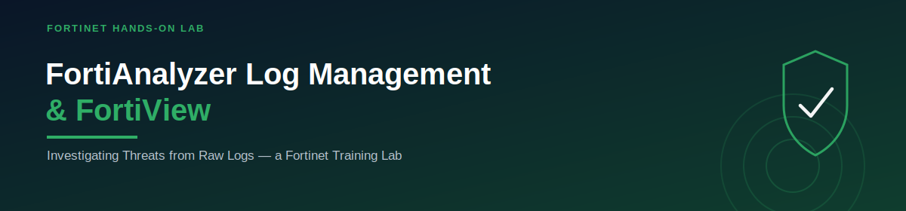

# FortiAnalyzer Log Management & FortiView – Investigating Threats from Raw Logs

> **Platform:** FortiAnalyzer (Centralized Logging) + FortiGate NGFW
> **Tools Used:** FortiAnalyzer GUI & CLI, FortiGate, Nikto Web Scanner, PuTTY, Linux Shell
> **Skills Demonstrated:** Log Import & Management, Log View Filtering, Custom Views, IPS Configuration, FortiView Threat Hunting, Traffic Analysis, CLI Diagnostics

---

## Project Summary

In this project, I worked with **FortiAnalyzer** as the central logging and analysis platform for a small FortiGate environment. I imported historical FortiGate log files, generated live traffic, examined that traffic in Log View, built a custom log view, configured IPS protection for a web server, launched a real attack against it with the Nikto scanner, and then used **FortiView** to detect and trace that attack back to its source. I finished by using FortiAnalyzer's CLI diagnostics to check log throughput and storage health.

---

## Environment

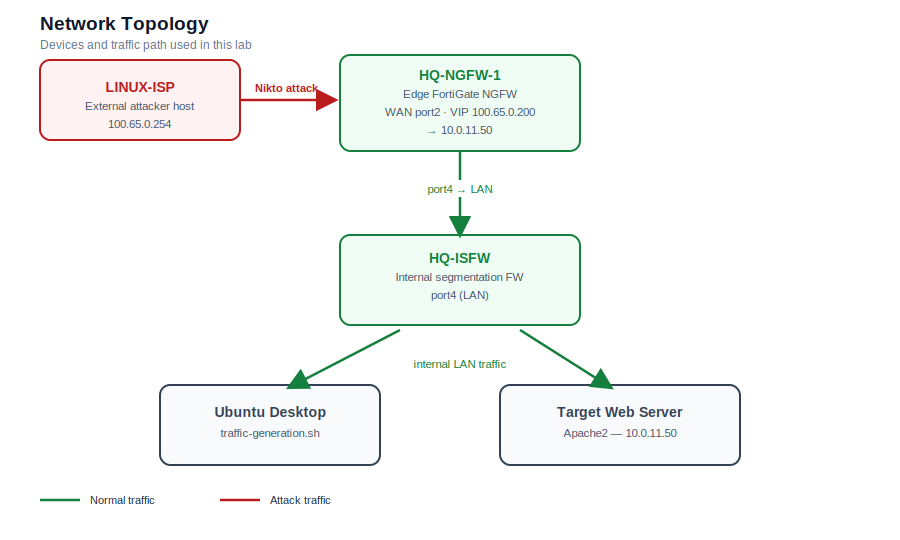

BR1-FGT-1 and FortiAnalyzer aren't part of this traffic path — they sit outside it, receiving logs from it. That log flow (and how it leads to the findings below) is broken out separately in [Log & Attack Investigation Flow](#log--attack-investigation-flow).

| Device             | Role                                           | Address / Notes              |
|---------------------|-------------------------------------------------|-------------------------------|
| HQ-NGFW-1           | Edge FortiGate NGFW (main lab firewall)         | Management GUI                |
| HQ-ISFW             | Internal segmentation firewall                  | Management GUI                |
| BR1-FGT-1           | Branch FortiGate (logs imported, not live)      | FGVM02TM24013504               |
| FortiAnalyzer       | Centralized log collection & analysis (ADOM1)   | 10.0.13.125                    |
| LINUX-ISP           | External attacker host (ran Nikto)              | 100.65.0.254                   |
| Target Web Server   | Apache2, reached through a Virtual IP           | 100.65.0.200 → 10.0.11.50      |

---

## Log & Attack Investigation Flow

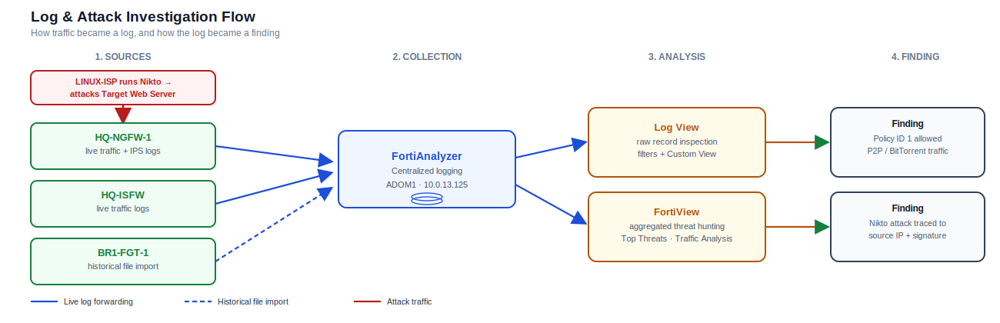

Three sources feed FortiAnalyzer — two live (HQ-NGFW-1, HQ-ISFW), one historical (BR1-FGT-1, imported from file). From there, the same data splits into two analysis styles: Log View for raw record inspection, FortiView for aggregated threat hunting. Each style led to a different kind of finding, walked through step by step below.

---

## Understanding the Logs (Key Terms)

Before getting into what I clicked, here's what the logs themselves actually contain — this is the vocabulary referenced throughout the steps below.

FortiAnalyzer organizes logs into a few major types. **Traffic logs** record every permitted connection — who talked to whom, over what port, and which firewall policy allowed it — and make up the bulk of normal log volume. **Security logs** (Application Control, IPS/Attack, Web Filter, Antivirus, etc.) record what FortiGate's inspection engines found *inside* that traffic, like a recognized app or a known exploit signature. **Event logs** cover administrative/system activity rather than traffic itself.

A single traffic log line carries a consistent set of fields no matter which device sent it:

| Field | What it means |
|-------|----------------|
| srcip / dstip | Where the connection came from, and where it was headed |
| srcport / dstport | The "door" used on each end — e.g. dstport 443 means HTTPS |
| action | What FortiGate did with it — `accept`/`pass` (allowed), `close` (session ended normally), `deny`/`drop` (blocked) |
| policyid | Which firewall rule matched and made that decision — lets you trace any log entry back to the exact policy responsible |
| service / app | The protocol or recognized application, e.g. `tcp/443`, `BitTorrent`, `Dropbox_File.Upload` |
| srccountry / dstcountry | GeoIP location of each end of the connection |
| sessionid | A unique ID tying every log line for one connection together |

In FortiView, threats are scored rather than just listed: **Threat Score** is a weighted severity number FortiGate assigns based on how dangerous a behavior pattern is, **Threat Level** buckets that score into Critical/High/Medium/Low, and **Incidents** is simply how many times that exact threat was logged. A threat type can have very few incidents and still be rated Critical — severity reflects the *type* of behavior, not how often it happened.

One more term used below: an **ADOM** (Administrative Domain) is how FortiAnalyzer separates logs and settings for different groups of devices. This lab used a single ADOM (`ADOM1`) covering all three FortiGates.

---

## What I Did

### 1. Imported Historical Log Files into FortiAnalyzer

Before generating any live traffic, I used FortiAnalyzer's **Log View → Logs → Import** feature to load several pre-collected sets of FortiGate log files (text, native, and CSV formats, covering late March through April) so that historical data was available for analysis without waiting on live traffic.

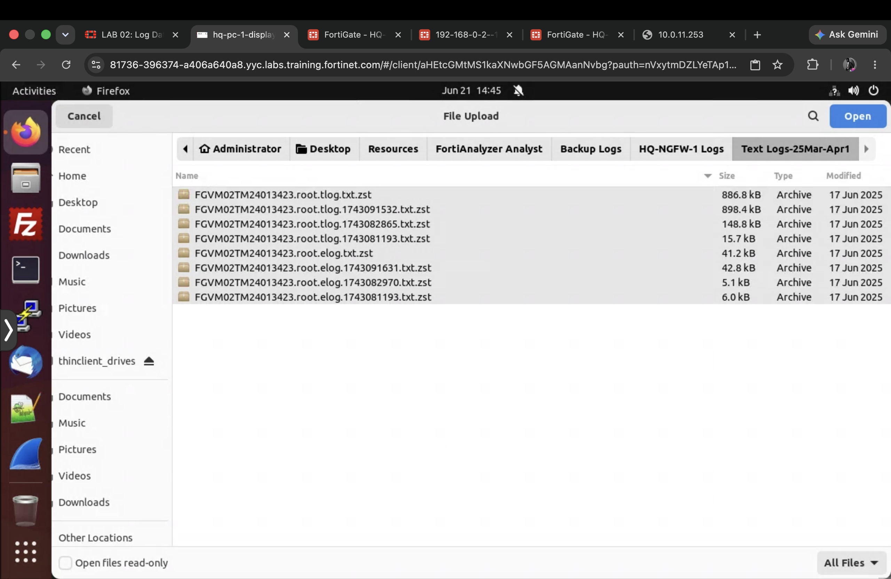

I browsed through the backup log folders on the jump host to select the correct archives for each device before uploading them.

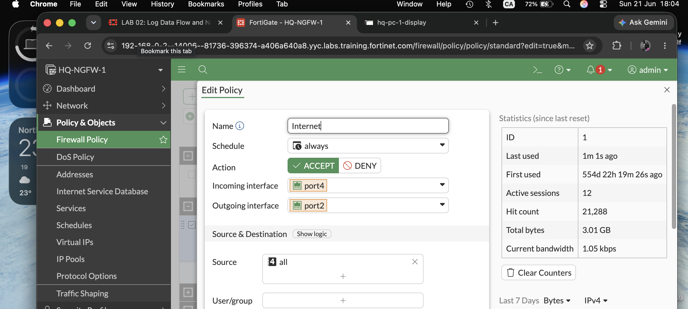

---

### 2. Reviewed the Firewall Policy Generating the Traffic

Before analyzing logs, I checked the **Internet** firewall policy on HQ-NGFW-1 that actually produces the traffic FortiAnalyzer would log — incoming on port4 (LAN), outgoing on port2 (WAN), with AntiVirus, Web Filter, and DNS Filter security profiles enabled.

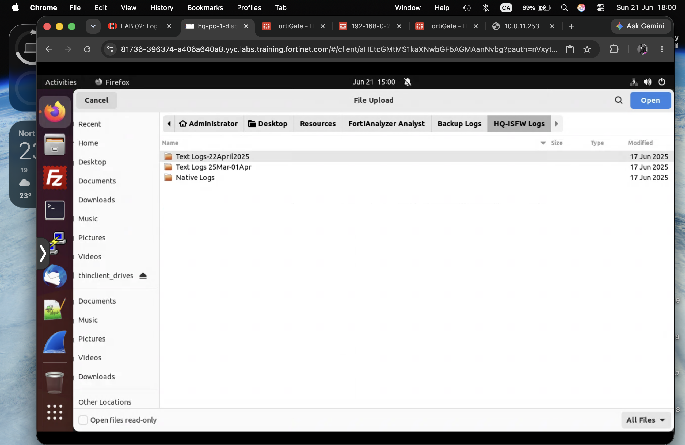

---

### 3. Generated Live Traffic for Analysis

To have real, current traffic to analyze (rather than only historical imports), I ran a traffic-generation script from the internal Ubuntu desktop. This simulated multiple users browsing, streaming, and using file-sharing apps so FortiAnalyzer would have a realistic mix of logs to work with.

```bash
./traffic-generation.sh
```

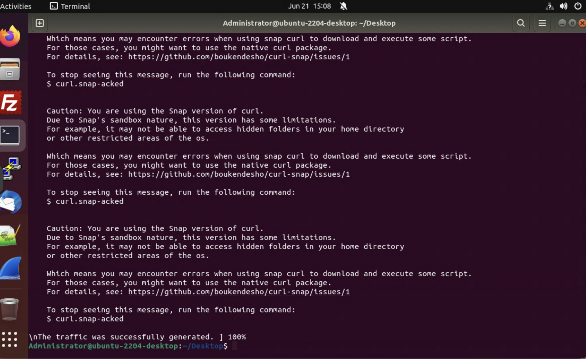

---

### 4. Examined Logs with Log View

With traffic flowing, I used **Log View → Logs** to inspect the raw traffic logs and drill into individual entries — each one expandable into its full set of fields (srcip, dstip, srcintf, dstintf, action, policyid, service, app, srccountry, sessionid, and more — see [Understanding the Logs](#understanding-the-logs-key-terms) above).

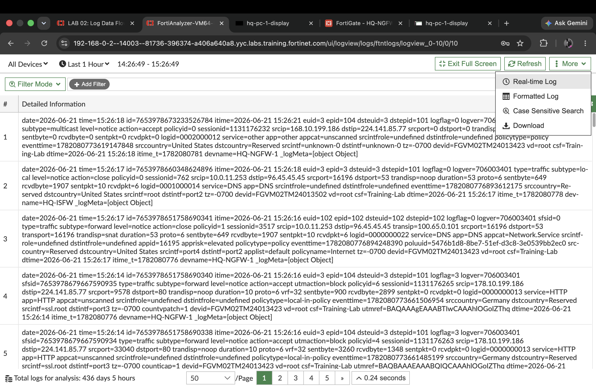

Taking the second entry in that view as an example, here's what its raw fields actually decode to:

| Field | Value | Meaning |
|-------|-------|---------|
| type / subtype | traffic / local | A **local** traffic log — generated by the firewall itself, not a session it's routing between two other hosts |
| action | close | The session ended normally on its own (not blocked, not dropped, not timed out) |
| policyid | 0 | No firewall policy applied — expected for local traffic, since the device isn't applying a security decision to its own traffic |
| srcip → dstip | 10.0.11.253 → 96.45.45.45 | HQ-ISFW's own LAN interface reaching out to an external IP |
| srcport → dstport | 16196 → 53 | Port 53 is DNS — this is a DNS lookup |
| proto | 6 (TCP) | The lookup went out over TCP rather than the more common UDP |
| service / app | DNS / DNS | FortiGate identified both the protocol and the application as DNS |
| sentbyte / rcvdbyte | 649 / 1907 | Sent a 649-byte query, got back a larger 1907-byte response |
| srccountry / dstcountry | Reserved / United States | Source is a private IP (no geolocation); the destination resolved to a US-based server |
| devname | HQ-ISFW | This entry came from the internal segmentation firewall, not the edge firewall |

In plain terms: this one line says HQ-ISFW did its own DNS lookup over TCP, got an answer back, and closed the connection cleanly — routine background traffic, not anything a user did.

I also checked the **Security: Summary** dashboard for a quick aggregated view. Its **Application Control** widget showed categories like `Network.Service`, `P2P`, `im`, and `Web.Client` all logged with an **action of "pass"** — meaning FortiGate recognized these applications but the policy let them through rather than blocking them. The **Intrusion Prevention** widget separately showed `test_botnet` and `test_attack` signatures with an action of "detected" — these are FortiGuard's built-in test signatures, used here to safely demonstrate that IPS detection is working without needing real malware traffic.

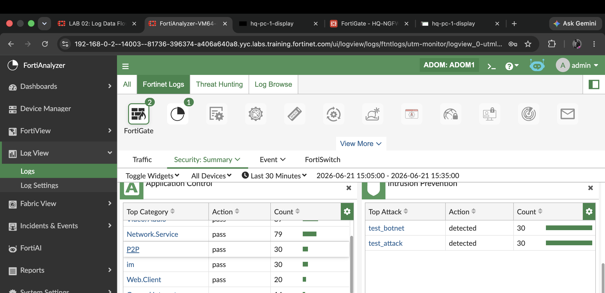

One useful finding here: filtering Application Control logs for P2P/BitTorrent traffic showed an **action of "pass"** under **Policy ID 1** — meaning the Internet policy matched this traffic, correctly identified it as BitTorrent, and still let it through. The log isn't an error; it's the policy working exactly as configured. The lesson is that "logged" and "blocked" are two different things — if P2P shouldn't be allowed, the fix is to change the policy's action or add an Application Control profile that blocks that category, not just to spot it in the logs.

---

### 5. Built a Custom View for Application Control

Rather than re-applying the same filters every time, I saved a **Custom View** named "Application Control Logs for Last 1 Day" scoped to Application Control logs across all devices. Each row ties a **User/Group** to the **Application** they used (BitTorrent, Vimeo_Play, YouTube_Play, Dropbox_File.Upload/Download, Dropbox_Login) and the broader **Application Category** it falls under (P2P, Video/Audio, Storage.Backup) — useful for spotting *who* generated a given type of traffic, not just that it happened.

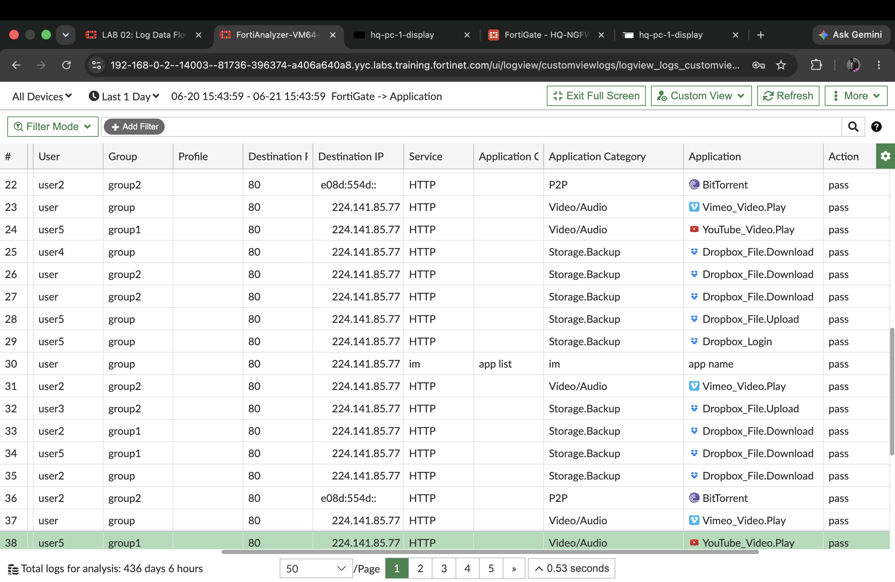

---

### 6. Configured an IPS Sensor for the Web Server

To protect the target web server, I built an IPS sensor named **WEBSERVER_Protection**, filtered to signatures targeting **Server**-side software, so FortiGate would only load signatures relevant to an exposed web server.

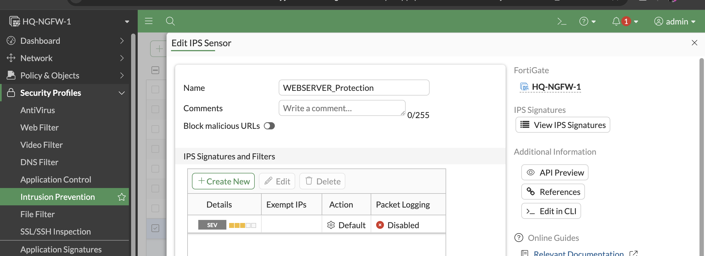

---

### 7. Verified the Target Web Server

Before attacking it, I confirmed the Apache2 web server was reachable through its public-facing Virtual IP.

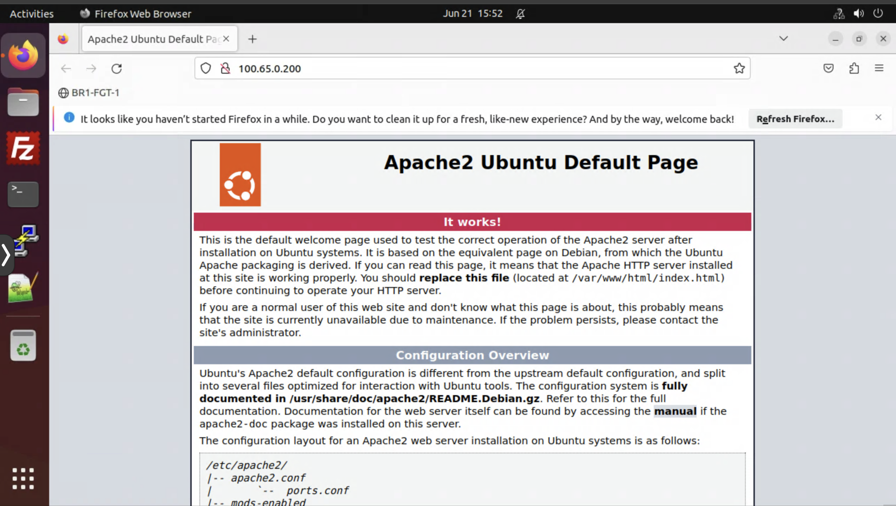

---

### 8. Simulated a Web Attack with Nikto

From the external **LINUX-ISP** host, connected over SSH via PuTTY, I ran the Nikto web vulnerability scanner against the target's public IP to generate real attack traffic for FortiAnalyzer to detect.

```bash
nikto.pl -host 100.65.0.200
```

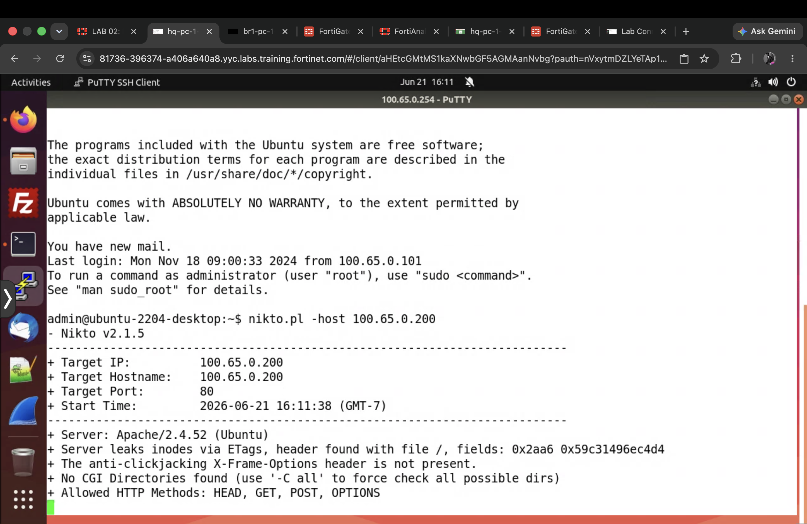

---

### 9. Investigated the Attack in FortiView

With the attack running, I switched to **FortiView → Threats → Top Threats** to see detected threats ranked by score, then filtered for **Threat Level = High** to cut out the noise. Two threats stood out: `blocked-connection` (Threat Score 240, **High**, 8 incidents — connections a firewall policy explicitly blocked) and `failed-connection` (Threat Score 175, **Low**, 35 incidents — connection attempts that simply failed). Despite having far fewer incidents, `blocked-connection` outranks `failed-connection` because it reflects a more deliberate, more dangerous pattern.

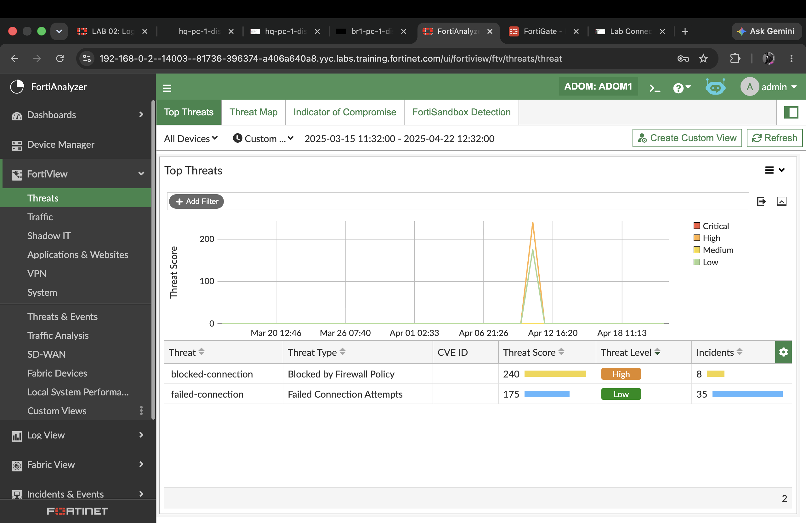

Drilling into one of the high-severity entries — a `tcp_syn_flood` detection (Threat Score 150, **Critical**, only 3 incidents) — showed the exact source IP responsible, along with the blocked/allowed counts. A SYN flood is when an attacker fires off a wave of connection-start packets without ever completing the handshake, trying to exhaust the server's connection table — which is why FortiGate rates it Critical even with very few incidents logged: the danger is in the *technique*, not the volume.

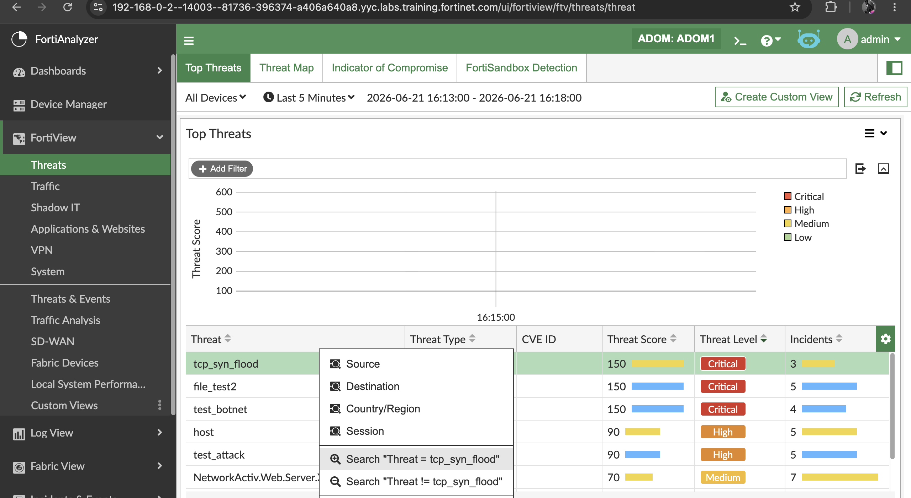

I then checked **Threats & Events**, which plots detected threats on a live world map and lists the top threat destinations — a fast way to spot where attacks are landing.

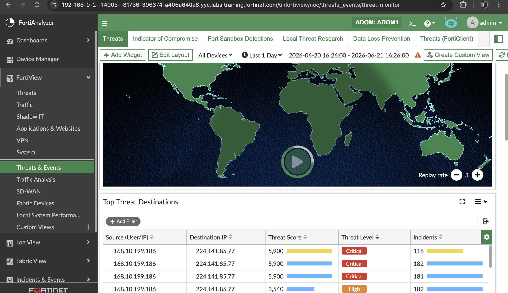

---

### 10. Analysed Traffic Patterns in FortiView

Switching to **FortiView → Traffic Analysis**, I reviewed overall bytes sent/received per host and the **Top Country/Region** breakdown — FortiAnalyzer uses GeoIP to map each destination IP to a country, which is a quick way to notice traffic heading somewhere it shouldn't. Drilling into a specific country showed which applications (DNS, HTTPS browsing, NTP, Dropbox) were generating that traffic, so a bandwidth spike is attributable to a specific app and host, not just a number on a chart.

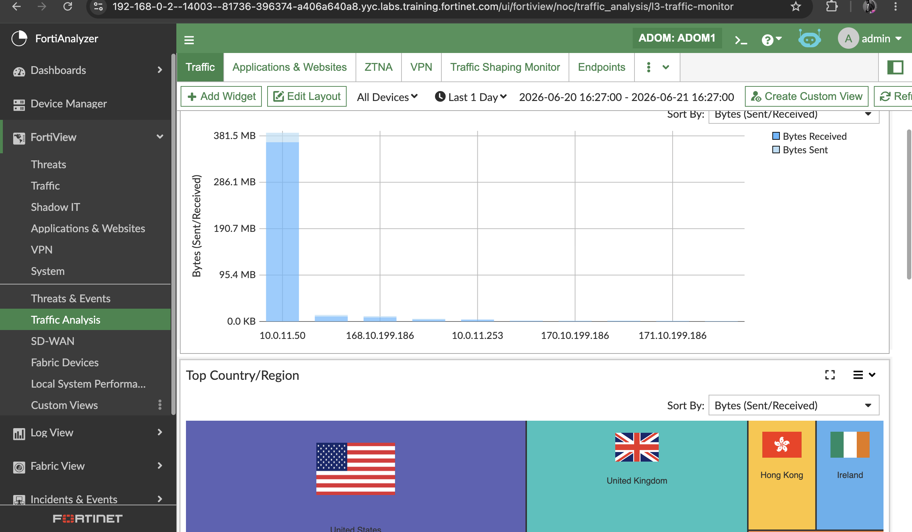

---

### 11. Checked Log Rate and Storage via CLI

To confirm FortiAnalyzer itself was healthy under load, I used CLI diagnostics to break down the **log insertion rate** by log type — essentially, how many logs per second FortiAnalyzer is receiving, split by category (Traffic, Attack, Virus, Web Filter, Application Control, etc.):

```bash
diagnose fortilogd lograte
diagnose fortilogd lograte-device
diagnose fortilogd lograte-type
```

The output showed Traffic logs arriving at roughly 1.42/sec over the last hour, while every security category (Attack, Virus, Web Filter, DLP) sat at or near 0.00/sec. That split tells you the vast majority of what's flowing in is ordinary permitted traffic, not security events — the expected pattern for a quiet network, and a quick way to confirm nothing is silently spiking.

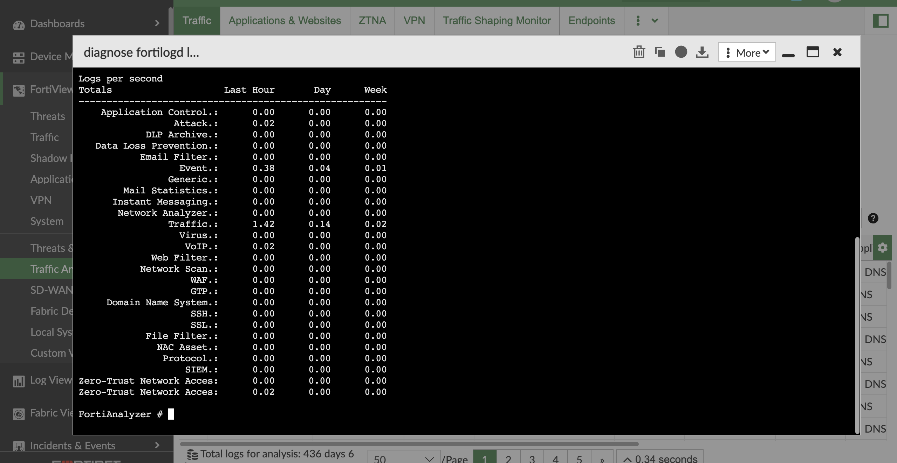

I also checked per-device disk usage and quota allocation, to make sure storage wasn't close to its limit:

```bash
diagnose log device
```

This breaks down, per device and per ADOM, how much space logs are actually using versus how much is allocated, plus the **retention period** — how long logs are kept before being purged (365 days for ADOM1 in this lab). All three FortiGates were using well under 1% of their allocated space, so storage and retention weren't a concern here — but in a busier production environment, this is exactly the command you'd run before logs start silently rolling off too early.

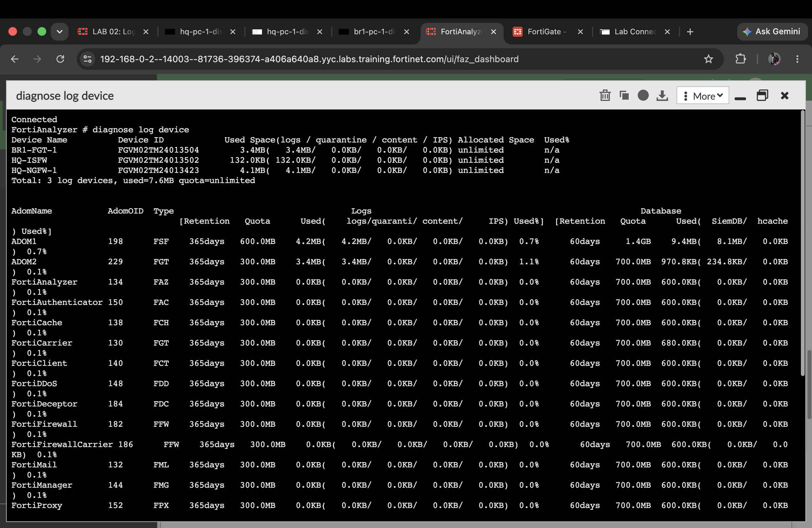

---

### 12. Reviewed the FortiAnalyzer Performance Dashboard

Finally, I checked the FortiAnalyzer **Dashboard** widgets for system utilization, insert rate vs. receive rate, and log insert lag time — confirming the platform was keeping up with the traffic generated during the lab.

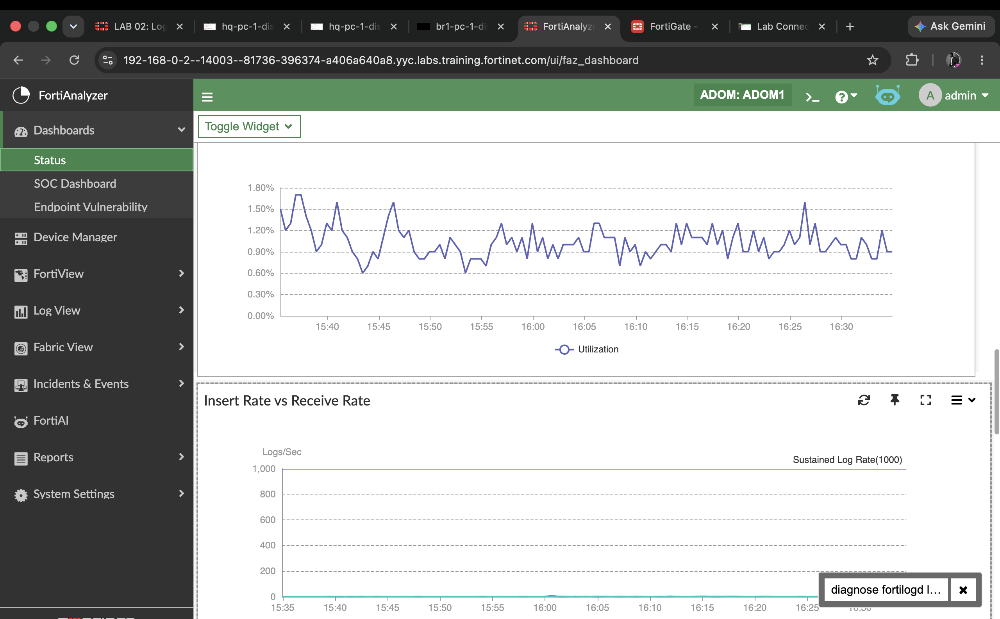

---

## Results

- Backfilled FortiAnalyzer with historical branch-office log files so analysis wasn't limited to live traffic only
- Used Log View filters and a saved Custom View to isolate P2P/BitTorrent and Dropbox activity tied to a specific policy
- Detected and traced a real Nikto-driven attack against the web server through FortiView's Top Threats, all the way down to the source IP and signature
- Confirmed FortiAnalyzer's log insert rate, lag time, and storage consumption stayed healthy throughout the test

---

## Key Learnings

- FortiAnalyzer can import historical/offline log files per device — useful for forensics or backfilling data for a device that wasn't always forwarding logs live
- Log View and FortiView serve different purposes: Log View is best for inspecting raw, detailed log records; FortiView is built for aggregated, threat- and traffic-centric pivoting
- Custom Views save a filtered query for one-click reuse instead of re-building filters every time
- An IPS sensor scoped to "Server" targets keeps signature matching focused on what's actually exposed, instead of loading every signature in the database
- CLI diagnostics (`diagnose fortilogd ...`) give a more real-time, granular view of FortiAnalyzer's own health than the GUI dashboard summarizes on its own
- Correlating a known attack (the Nikto run) with what shows up in FortiView's Top Threats is a quick way to confirm detection is actually working end-to-end, not just configured
- Threat Score/Level and incident count measure different things — a low-incident threat like a SYN flood attempt can outrank high-incident noise like failed connections, because severity reflects the technique, not how often it happened
- "Logged" and "blocked" are not the same thing — Application Control can correctly identify and log an app (e.g. BitTorrent) while the policy's action still lets it through; fixing that requires changing the policy, not just noticing the log

---

*Part of my Fortinet security portfolio — [github.com/iVanny11-tech](https://github.com/iVanny11-tech)*
